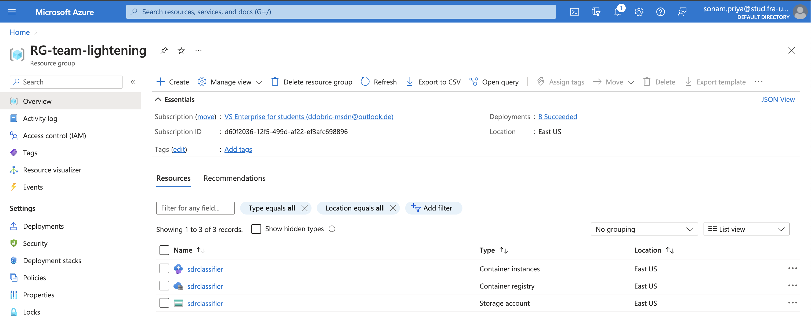

# ML22/23-4 Investigate and Implement SDR Classifier - Team-Lightening - Azure Cloud Implementation

## Description

This experiment demonstrates a Multisequence learning experiment using SDRClassifier and complete HTM pipeline inlcuding Encoders, Spatial Pooler and Temporal Memory. In the final stage, job of classification of SDRs provided by Temporal memory is achieved using a SDRClassifier, configured in a zero step mode.

In this experiment, we first convert the raw sequence inputs into SDRs using the scalar encoder. In the next steps, we train the Spatial pooler and Temporal memory using the inputs of scalar encoder, with a total of 3500 cycles for each sequence. On the other hand, once the training of spatial pooler and Temporal memory is completed, we train the SDR Classifier, using the predictive cells of Temporal memory and Bucket index of scalar encoder, with a maximum of 3500 cycles.

While we train the SDR Classifier, we keep measuring the attained accuracy after each cycle. As a matter of fact, SDR Classifier updates its weight matrix during its supervised training phase, so that it could attain maximum possible accuracy.

In this experiment, we weight upto 30 times, until the accuracy of learning reaches maximum possible accuracy, which is 100 in this case. This part is repeated for each sequence. During each training cycle set, once training of SDR Classifier for a sequence is completed, temporal memory is reset. This enables the first element starts always from the beginning.

After a certain number cycles, which is around 250 to 300 in this experiment, learning gets completed for both the sequence.
Once the model is trained with both the sequence, it is available to use for predictions.

In the next steps, we feed a few relevant numbers to the model. The model predicts the next element and the name of the sequence in which there is a highiest probablity of that number to appear. Based on the predicted results, average accuracy of the model is calculated.

## Software Engineering Project

[MySEProject](https://github.com/Sonam-22/neocortexapi/tree/team-lightening/source/MySEProject/SDRClassifier)

[SDR Classifier documentation](https://github.com/Sonam-22/neocortexapi/blob//team-lightening/source/MySEProject/Documentation/SDR-Classifier.pdf)

[SDR Classifier readme](https://github.com/Sonam-22/neocortexapi/blob//team-lightening/source/MySEProject/Documentation/README.md)

[SDR Classifier](https://github.com/Sonam-22/neocortexapi/blob//team-lightening/source/MySEProject/SDRClassifier/SDRClassifier/SDRClassifier.cs)

[SDR Classifier unit tests](https://github.com/Sonam-22/neocortexapi/blob//team-lightening/source/MySEProject/SDRClassifier/SdRClassifierTest/SDRClassifierTest.cs)

## Cloud Project Structure

[MyCloudProjectSample](https://github.com/Sonam-22/neocortexapi/tree//team-lightening/source/MyCloudProjectSample)

[Cloud Experiment](https://github.com/Sonam-22/neocortexapi/tree//team-lightening/source/MyCloudProjectSample/MyExperiment)

[Multi sequence experiemnt](https://github.com/Sonam-22/neocortexapi/blob//team-lightening/source/MyCloudProjectSample/MyExperiment/MultiSequenceExperiment.cs)

[Cloud Project](https://github.com/Sonam-22/neocortexapi/tree//team-lightening/source/MyCloudProjectSample/MyCloudProject)

## Input to the experiment

Input to this experiment are two training sequeneces of numbers, namely S1 and S2, and the prediction sequences. Training sequences are used for training the model and prediction sequences are used for validation of trained model through predctions. Below mentioned code snippet shows the training data used for the experment.

```json
{
    "Sequences": {
        "S1" : [0.0, 1.0, 2.0, 3.0, 4.0, 2.0, 5.0],
        "S2": [8.0, 1.0, 2.0, 9.0, 10.0, 7.0, 11.00]
    },
    "Validation" : [
        [1.0, 2.0, 3.0, 4.0, 2.0, 5.0],
        [2.0, 3.0, 4.0],
        [8.0, 1.0, 2.0]
    ]
}
```
[Input File](https://github.com/Sonam-22/neocortexapi/blob/team-lightening/source/MyCloudProjectSample/MyCloudProject/SampleFiles/training.txt)

## Output of the experiment

The output of this experiment is the predictions of Sequence and next element for a given number. The numbers mentioned in `Validation` section are fed into predictor. Predictor outputs the sequence name and next element that may appear in the predicted sequence. Predictor also outputs next three sequence and element which are closest to the input. For example, when the input is 4, the predicted sequence and next element output the from the predictor becomes S1 and 2.0. Along with this, we also get closest sequence information and average accuracy of the predictions for the given input set.

```text
--------------- Input 4 ---------------
S1_5-0-1-2-3-4-2 - 96.36706626716217%
S1_-1.0-0-1-2-3-4-2 - 0.15814154549407908%
S2_8-1-2-9-10-7-11 - 0.08755238852710039%
Predicted Sequence: S1, predicted next element 2
```

```text
Prediction accuracy for 1,2,3,4,2,5 is 100%.
```
Other than this, we also get the trained model which could be used for prediction.
Overall, example output and training logs could be found here.

[Output File](./outputfile.txt)

[Complete expreiment run on azure cloud](./cloud-training--and-predictions-output.txt)

**Note:** the cloud run logs are out of sync because this is the way azure container logs behaves while log streaming.

## Working of Algorithm 

In this experiment, we have basically validated the working of SDR Classsifier in a complete HTM pipeline. Figure below describes overall working of the algorithm.

<figure>

<figcaption>Fig. 1 SDR Classifier</figcaption>
</figure>

**SDR Classifier**

Let's first understand the working of SDR Classifier. it works on the principles of supervised learning and feed forward neural network. During the training phase, classifier recieves the indices of active cells from the Temporal memory. Along with that, Classifier also recieves the actual input and bucket index of the input used by the encoder to encode the input. Bucket indexes and actual inputs are helpful in retracing the actual input as during the predictions, classifier only provides the bucket indexes and its likelyhood of matching the actual input. The classifier works as described below:

1. The classifier takes indices of active cells from temporal memory and bucket index and actual values from the encoder.
2. The SDR classifier maps input patterns to class labels. There are as many
   output units as the number of class labels or buckets (in the case of scalar
   encoders). The output is a probabilistic distribution over all class labels.
3. During inference, the output is calculated by first doing a weighted summation
   of all the inputs, and then perform a softmax non-linear function to get
   the predicted distribution of class labels.
4. During learning, the connection weights between input units and output units
   are adjusted to maximize the likelihood of the model.  

Detailed description of wroking the SDR Classifier is avaialable in our SE Project documentation

[SDR Classifier documentation](https://github.com/Sonam-22/neocortexapi/blob//team-lightening/source/MySEProject/Documentation/SDR-Classifier.pdf)

**Wroking of the complete model in experiment**

The experiment follows the steps mentioned in Fig. 1

_During the Training_

1. Sequence inputs is fed into the scalar encoder as numbers of type double.
2. Scaler encoder converts the double numbers into its SDR representation.
3. SDR representation is fed as input into the spatial pooler.
4. Output of the Spatial pooler is fed into the Temporal memory.
5. Temporal memory outputs the active cells and the predictive cells.
   Active cell are used for training the classifier and predictive cells are used for prediction and inference.
6. SDR Classifier is fed with the active cell indices and bucket index and classifier's learn method is called with inference off.
7. The SDR classifier is configured in a 0 step configuration, so that the classifiers prediction mechanism is switched off. This is done because 
the actual job prediction is already done by Temporal memory and SDR Classifier is used only for the task of classification.

_During the Prediction_

1. Input number is fed to the model using the predictor utility

```csharp
public List<ClassifierResult<string>> Predict(double input)
{
  var lyrOut = this.layer.Compute(input, false) as ComputeCycle;

  var indices = lyrOut.PredictiveCells.Select(cell => cell.Index).ToArray();

  List<ClassifierResult<string>> predictedInputValues = this.classifier.GetPredictedInputValues(indices, 3);

  return predictedInputValues;
}
```
2. Predictive cell indices provided by the temporal memory are provided to the classifiers prediction function to recieve the closest 3 predictions.

3. Predicted sequence information is returned.

## Running the expermient on Azure Cloud.

In order to run the experiment on the Azure Cloud, the experiment code is built as Docker image which could be directly deployed as Azure Container Instances(ACI). The docker image is hosted on Azure Container Registry. Following commands will describe the way to run the experiment on the cloud.

### Architecture of experiment.

<figure>

<figcaption>Fig. 2 Cloud architecture</figcaption>
</figure>

Docker image:

```text
docker pull sdrclassifier.azurecr.io/cloudcomputing/sdrclassifier:v1
```

### Deploying the docker image on cloud.

Once you are logged in to azure using the azure cli, use the below command to deploy the experiment image on the Azure Cloud.

```shell
# Login to azure using azure cli
az login

# Set the correct subscription id
az account set -s <subscription-id>

# Login to docker registry first. This will expose the token in TOKEN enviroment variable.
TOKEN=$(az acr login --name sdrclassifier --expose-token --output tsv --query accessToken)

# Deploy the container on Azure Container Instances(ACI)
az container create -g RG-team-lightening --name sdrclassifier --image sdrclassifier.azurecr.io/cloudcomputing/sdrclassifier:v1 --cpu 1 --memory 1 --restart-policy Never --registry-password $TOKEN --registry-username 00000000-0000-0000-0000-000000000000
```
Output after successful experiment image deployment.

<figure>

<figcaption>Fig. 3 Container deployed using az cli</figcaption>
</figure>

Once the image is deployed and docker container is created, you will be able to see the following log as container logs.

```shell
// Streaming the container logs
az container logs --follow --name sdrclassifier --resource-group RG-team-lightening
```

```text
Started experiment: ML22/23-4 Investigate and Implement SDR Classifier
info: Train.Console[0]
      9/3/2023 1:28:35 AM -  Started experiment: ML22/23-4 Investigate and Implement SDR Classifier
```
Now the experiment app is ready to consume the queue message.

<figure>

<figcaption>Fig. 4 Running experiment container instance</figcaption>
</figure>

Figure below shows all the resources deployed under team lightening resources group

<figure>

<figcaption>Fig. 5 Resources under team lightening</figcaption>
</figure>

### Execute the experiment

1. The experiment consumes the training files present in `training-files` blob container. We have already placed required training file
`training.txt` in this container. This could also be uploaded from [here](https://github.com/Sonam-22/neocortexapi/blob//team-lightening/source/MyCloudProjectSample/MyCloudProject/SampleFiles/training.txt)

<figure>

<figcaption>Fig. 6 Training blob container</figcaption>
</figure>

2. Once the training files are available, we need to begin the experiment by passing following message to the `trigger-queue` as text message.

```json
{"ExperimentId": "1", "InputFile":"training.txt", "Description": "Test", "Name": "Test"}
```
Message could be sent to the queue using azure portal or the storage explorer.

<figure>

<figcaption>Fig. 7 Add message</figcaption>
</figure>

<figure>

<figcaption>Fig. 8 Message in queue</figcaption>
</figure>

The message will be parsed as the `ExerimentRequestMessage` and experiment will begin. This could be verified using container logs.

The experiment will download the training file `training.txt` and read the content as `TrainingData` 
```csharp
public class TrainingData
{
  public Dictionary<string, List<double>> Sequences { get; set; } = new();
  public List<double[]> Validation { get; set; } = new();
}
```
The `Sequences` field will be used for training and `Validation` field will be used for predictions.

3. On completion of training and prediction phase is completed, experiment completed and the experiment application again goes into wait mode, waiting for the next queue input.

4. On completion, generated output files are uploaded into `result-files` blob container. Moreover, a record is added into `results` storage table.

<figure>

<figcaption>Fig. 9 Output blob container</figcaption>
</figure>

<figure>

<figcaption>Fig. 10 Result storage table</figcaption>
</figure>

5. Once the experiment and result verification is completed, in order to save resources and costs, running container should be deleted using the following command.

```shell
az container delete -g RG-team-lightening --name sdrclassifier
```

### Blob containers and Storage account

Storage Account Name: **sdrclassifier**

Blob Containers:  
- 'training-files' : contains the training file `training.txt`  
- 'result-files' : contains the output file `output.txt`

<figure>

<figcaption>Fig. 11 Blob containers</figcaption>
</figure>

Queues:
- 'trigger-queue' : stores the messages to run the experiment.

<figure>

<figcaption>Fig. 12 Queues</figcaption>
</figure>

Tables:
- 'results': stores the experiment result records.

<figure>

<figcaption>Fig. 13 Tables</figcaption>
</figure>

Table Columns description:

<figure>

<figcaption>Fig. 14 Table description</figcaption>
</figure>

- Partition Key: Holds the group name, which is eventually the partition key for the table.
- Row Key: Row number of the record.
- Timestamp: Timestamp of the start of experiment
- Accuracy: Average accuracy of the experiment
- Decription: Description of the experiment
- DurationSec: Total number of seconds elapsed during the complete experiment.
- EndTimeUtc: Completion time of experiment in UTC.
- ExperimentId: Identifier or ID of the experiment.
- InputFileUrl: URL of the input file with respect to the container and storage account.
- Name: Name of the experiment
- OutputFiles: Comma seperated urls of the output files generated by the experiment with respect to storage account and blob container.
- StartTimeUtc: Time of the begining of the experiment in UTC.

## Docker commands and operations

Building the docker image

```shell
# execute the following command from source folder
sh build-docker-image.sh
```
Publishing the docker image

```shell
az acr login --name sdrclassifier
docker push sdrclassifier.azurecr.io/cloudcomputing/sdrclassifier:v1
```